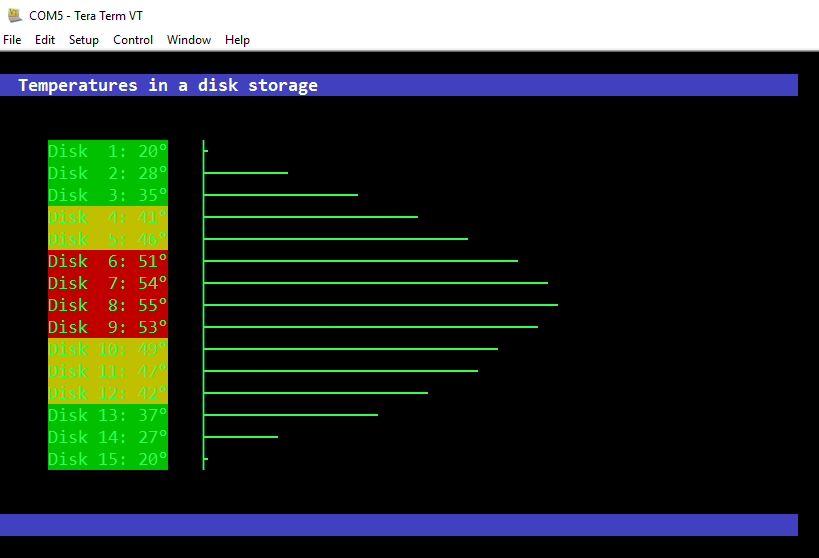

# mcurses

"mcurses" is a minimized version of programming library [ncurses](https://en.wikipedia.org/wiki/Ncurses) which gives GUI like interfaces on text terminal.

The library [mcurses](http://www.mikrocontroller.net/articles/MCURSES) was originally written by Frank M. for a number of microcontrollers.

This version runs directly on Arduinos.

The serial driver interfaces are replace by call-back-function so you can hook any In-Output to the library.
This looks as follows:

```
setFunction_putchar(Arduino_putchar); // tell the library which output channel shall be used
setFunction_getchar(Arduino_getchar); // tell the library which input channel shall be used  
```
Please take a look into the examples to see how it is to be done exactly.
  
## What do you need to use this Library?

You need to install a **terminal programm** on your computer to visualize the characters sent and received by the serial line of your computer.
The Arduino IDE has a build in serial terminal but for this libray the terminal has to emulate the VT220 standard.
The Arduino terminal does not to this and therefore you need a separate terminal program.

## On Windows you can uses for example

- PuTTY
- teraterm

There may be several others but his two I have tested.

## On Linux you can use for example 

- minicom ( does not support VT220 but VT102 )

minicom -c on -b 115200 -D /dev/ttyACM0 

The parameters have the following meaning

-c on : turn colors on

-b 115200: set baud rate to 115200

-D /dev/ttyACM0: the port to which the Arduino is connected

Hint: minicom can not display all graphics correctly because it supports only VT102 or ANSI and not VT220. Therefore it seems to have some problems with the colors. To solve this, change the terminal type manually  to ‘ansi’. Also it seems to have some issues with the graphical symbols for lines and corners.


## Examples

### Temperature Demo
The "temperature_demo" displays  bar graphs of a simulated disk storage.

<p align="center">
  
</p>

### Hex Editor Demo 
Here is the "hexeditor_demo". 

<p align="center">
  
</p>

In this picture it is running on an ARDUINO UNO but you can easily include it on any microcontroller as follows:
```
#include "hexedit.h"

...
static uint16_t    memmoryStartAddress = 0x100;    // ATMEGA RAM start

hexedit (memmoryStartAddress);
...
```
For detailed information see the "hexeditor_demo".

